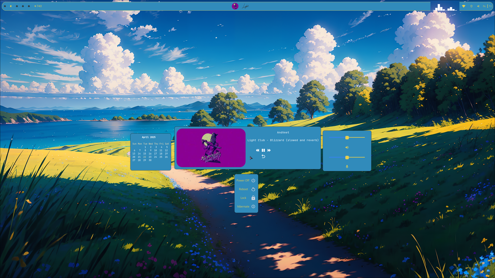
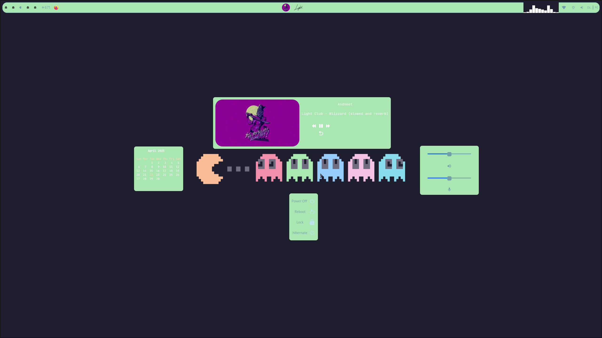
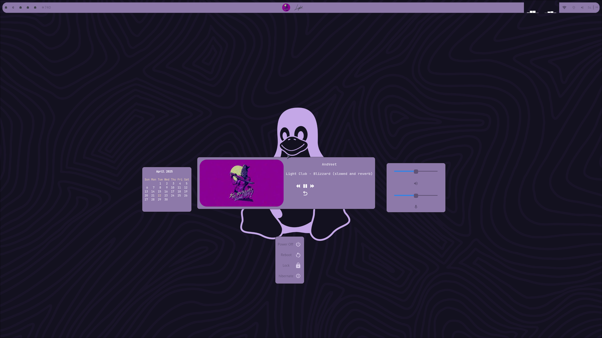
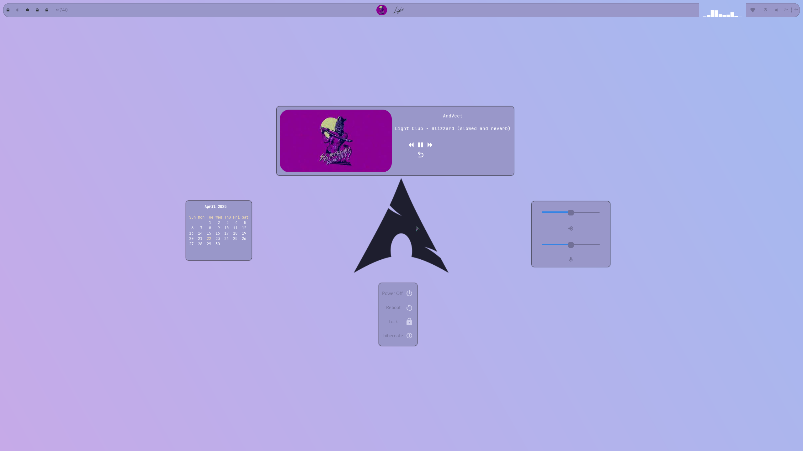

# 🎲 Dice

> 

**Dice** is a modern, customizable system bar built for Linux using Python, GTK, and D-Bus. It provides essential system info, workspace switching, media control, and more — all in a clean, responsive UI.

---

## ✨ Features

- 🕒 **Time & Calendar**: Displays the current time. Click to reveal a full calendar.
- 🔊 **Audio Control**: Adjust system volume and microphone levels.
- ⚡ **Power Options**: Lock, reboot, shutdown, or hibernate your system.
- 📶 **Wi-Fi Status**: Shows connection status via icon. Hover reveals SSID.
- 📈 **CAVA Integration**: Audio visualization built into the bar.
- 🎵 **Media Controls**:
  - Displays the current playing media title
  - Click to reveal title, artist, album art, and control buttons (play/pause, forward, backward, reset)
  - Thumbnail image auto-updates and appears as a rounded preview
- 🪟 **Active Window Preview**: Hover over the app icon to see the current active window.
- 📦 **Pacman Package Tracker**: Monitors and tracks available package updates.
- 🖥️ **Workspace Switcher**:
  - 5 dynamic workspaces
  - Icon updates based on current workspace
- 🧩 **Modular Configuration**:
  - Fully configurable via `config/config.json`
  - Define custom labels (e.g., hardware info)
  - Add custom buttons with Linux command actions (and .sh files)
  - Change bar layout on the fly
- 🎨 **Custom Styling**: Easily modify the look and feel via `config/style.css`

---

## 🛠️ Built With

- **Python 3**
- **GTK** – For GUI components
- **D-Bus** – For system/media control

---

## 📸 Screenshots

>     

---

## 📦 Installation

make sure these packages are installed on your system
`sudo pacman -S python-gobject gtk3 pipewire pipewire-pulse`

1. **Clone the repo**
   ```bash
   pip install pyGObject cairo
   https://github.com/NaturalCapsule/Dice
   cd Dice
   GDK_BACKEND=wayland python bar.py
   ```


